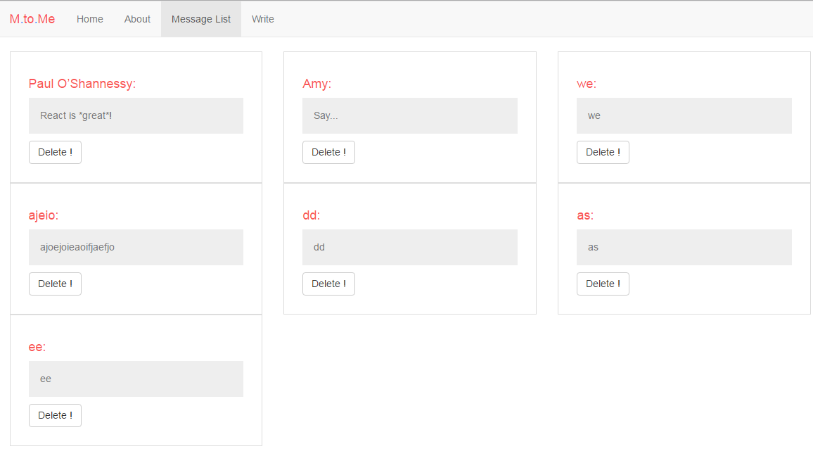

# message-board

## 1. 安裝
安裝 package.json 裡的 npm package
```sh
$ npm install
```
###### 目前詳細 package 直接參閱 package.json


## 2. 測試
######  配合 webpack-dev-server：
#
```sh
$ npm start 
或者
$ npm run current

將執行 server.js 配合 webpack-dev-server ，兩個port 並行
網址 127.0.0.1:3000
```

######  配合 webpack-hot-middleware：
#
```sh
$ npm run oneport 

執行使用 webpack-hot-middleware 方法運行
網址 127.0.0.1:8080
```

## 3. 資料儲存
###### 目前使用RenewData.js 儲存client端資料
#

